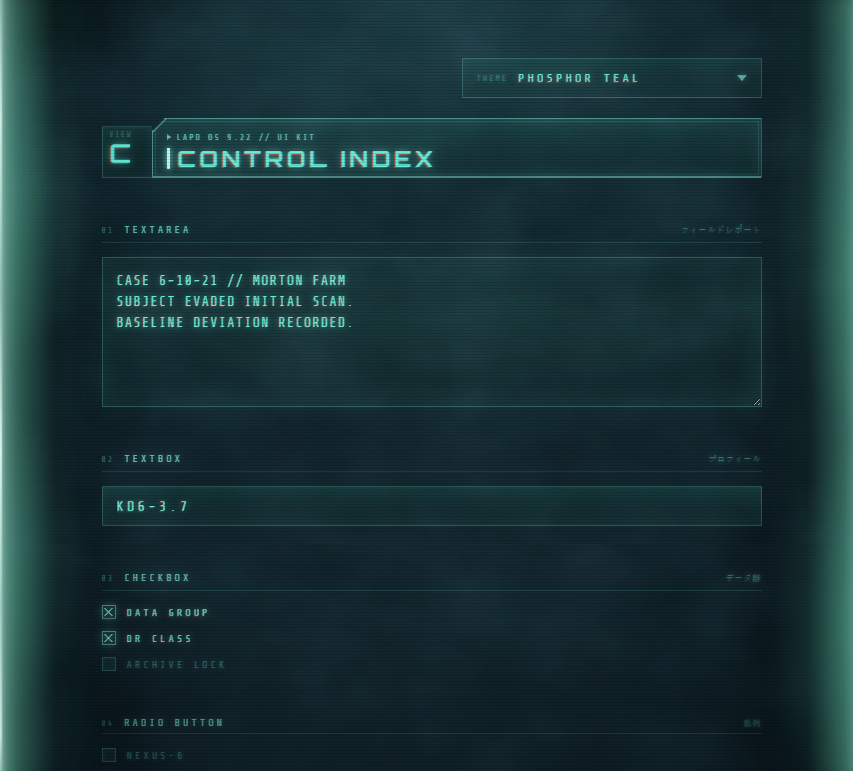
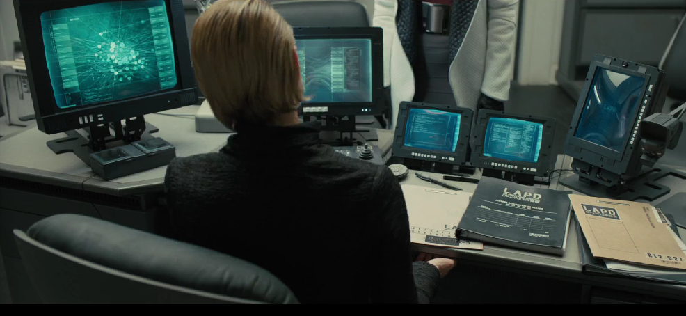
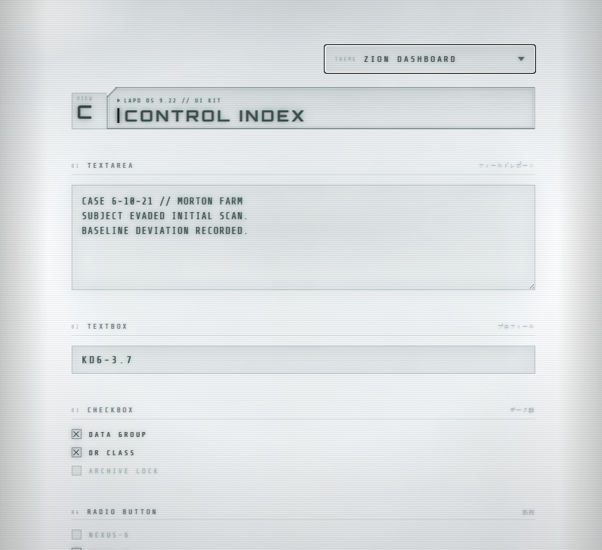
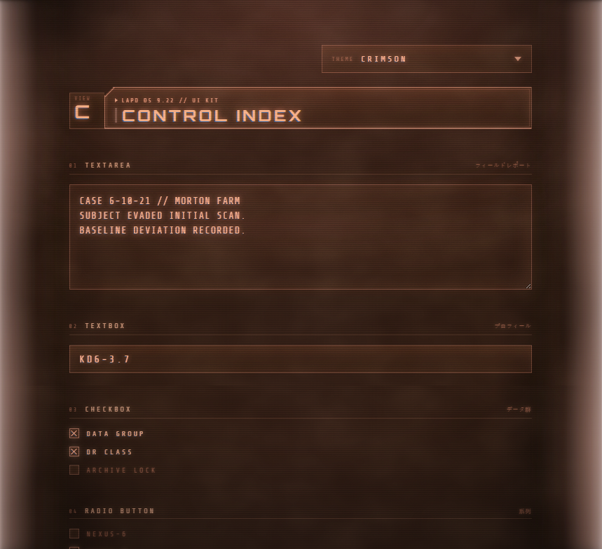

<div align="center">

# Blade Runner 2049 : LAPD Style

### A pure HTML + CSS interface kit, built in the image of the LAPD console aesthetic from *Blade Runner 2049*.



</div>

---

## Why this exists

I'm a huge fan of Blade Runner. And I find the **Blade Runner 2049 LAPD aesthetic absolutely inspiring**: amazing, poetic, a genuine piece of art. The phosphor glow on black glass, the chromatic-aberration fringe on every glyph, the quiet hum of scanlines and film grain, the spare Orbitron numerals sitting in the dark like something half-remembered. It's restraint and atmosphere doing the work. It's beautiful.

<div align="center">



*The direct inspiration: Lt. Joshi (Robin Wright) at her LAPD workstation in* **Blade Runner 2049** *. Those teal terminals are exactly what this kit is reaching for. (Film still, included here purely as a visual reference.)*

</div>

I wanted to **port my own systems into that world.**

This isn't a throwaway theme experiment. I *dogfood* my tools. I sit in front of my own software for hours and hours, every day. If I'm going to spend my life inside an interface, it shouldn't just be usable. It should be something I'm **in love with.** Something that makes the work feel like it belongs to a future worth looking at.

This is it. This is the interface I want to live in.

So I'm building it out properly, control by control, into a clean and reusable styling system that any of my projects can wear. Open source, because the aesthetic deserves to be shared.

---

## What it is

A component library styled after the LAPD terminals of *Blade Runner 2049*, written in **pure HTML and CSS**. No JavaScript, no build step, no framework, nothing to install beyond two Google Fonts.

- **21 controls**, each in its own stylesheet, all sharing one design core.
- **Pure CSS interactivity.** Comboboxes, tabs, tree views, multi-select and tooltips all run on `:checked` and `:hover` state alone.
- **7 built-in themes** via hue-rotation, from the default Phosphor Teal to an inverted "Zion Dashboard" light mode.
- A full **atmosphere layer**: scanlines, film grain, phosphor mottle, vignette, and glass-edge halation that turns a flat page into a screen you're *looking through a lens at.*
- Faithful detail work: chromatic-aberration text glow, corner registration marks, clipped panel corners, blinking carets, and that soft "nothing here is quite in focus" optical blur.

---

## The look

Three of the seven themes, same `CONTROL INDEX` screen:

| Phosphor Teal *(default)* | Zion Dashboard *(inverted)* | Crimson |
|:---:|:---:|:---:|
|  |  |  |

Themes are switched by a single set of body-level radios and work by hue-rotating the three colored layers (background, console, edge glow). The full set: **Phosphor Teal · Teal Blue · Teal Blue V2 · Amber · Crimson · Violet · Zion Dashboard.**

---

## The controls

Everything currently lives in [`dna-station/html-css/`](dna-station/html-css/). Open [`index.html`](dna-station/html-css/index.html) for the full showcase, or any file in [`examples/`](dna-station/html-css/examples/) for a single control in isolation.

| # | Control | # | Control |
|---|---------|---|---------|
| 01 | Textarea | 12 | Button, icon |
| 02 | Textbox | 13 | Toggle switch |
| 03 | Checkbox | 14 | Progress bar |
| 04 | Radio button | 15 | Spinner |
| 05 | Combobox *(CSS-only)* | 16 | Status badge |
| 06 | Tab control *(CSS-only)* | 17 | Tooltip *(CSS-only)* |
| 07 | Datagrid | 18 | Tree view *(CSS-only)* |
| 08 | Slider | 19 | Color picker |
| 09 | Image display | 20 | Multi-select *(CSS-only)* |
| 10 | Image upload | 21 | Autocomplete *(CSS-only)* |
| 11 | Button, text / ghost | | |

---

## Quick start

Load the framework once, then add any control stylesheet you need:

```html
<link rel="preconnect" href="https://fonts.googleapis.com">
<link rel="preconnect" href="https://fonts.gstatic.com" crossorigin>
<link href="https://fonts.googleapis.com/css2?family=Orbitron:wght@500;600&family=Share+Tech+Mono&display=swap" rel="stylesheet">

<link rel="stylesheet" href="dna-station/html-css/css/core.css">
<link rel="stylesheet" href="dna-station/html-css/css/controls/textbox.css">
```

Drop the inert atmosphere layers in once, at the end of `<body>`:

```html
<div class="bg"></div>
<main class="console"> <!-- your UI --> </main>

<div class="mottle"></div>
<div class="scanlines"></div>
<div class="grain"></div>
<div class="vignette"></div>
<div class="edge-glow"><i></i><i></i></div>
```

Each control's required markup is documented at the top of its stylesheet, with a matching demo in `examples/`.

---

## Project structure

```
blade-runner-2049-lapd-style/
├── README.md                  (you are here)
├── docs/screenshots/          (gallery imagery)
└── dna-station/
    └── html-css/
        ├── index.html         (full showcase + theme switcher)
        ├── README.md          (kit-level documentation)
        ├── css/
        │   ├── core.css       (tokens, reset, atmosphere, themes, chrome)
        │   └── controls/      (one stylesheet per control, 20 files)
        └── examples/          (one standalone demo per control)
```

`dna-station` is the first module. The structure is built to grow. More surfaces and screens will land alongside it, all drawing from the same `core.css`.

> **On the CSS-only controls:** combobox, tabs, tree, multi-select and autocomplete are driven entirely by radio/checkbox state, with zero JavaScript. That requires a small block of per-instance "wiring" rules, clearly commented in each file. A future optional JS layer will remove that ceremony for stateful controls.

---

## Roadmap

- [ ] Publish the styles as an npm package.
- [ ] Optional JS layer to drop the per-instance wiring on stateful controls.
- [ ] Export design tokens standalone (`tokens.css` / JSON).
- [ ] More screens and surfaces under `dna-station` and beyond.
- [ ] Choose and add a `LICENSE`.

---

## Credits & disclaimer

Typefaces: [**Orbitron**](https://fonts.google.com/specimen/Orbitron) and [**Share Tech Mono**](https://fonts.google.com/specimen/Share+Tech+Mono) (Google Fonts).

This is an independent, non-commercial **fan homage** to the visual design of *Blade Runner 2049*. It is not affiliated with, endorsed by, or associated with Alcon Entertainment, Warner Bros., or any rights holder. All trademarks belong to their respective owners. Made out of pure admiration for the film's art direction.
